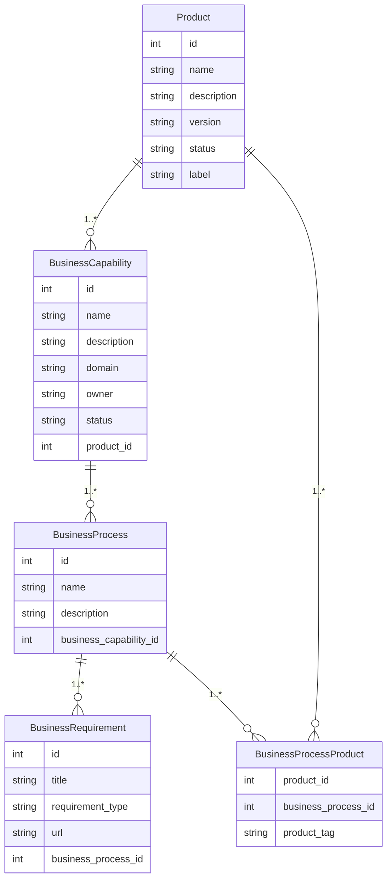

```mermaid
erDiagram
    Product ||--o{ BusinessCapability : "1..*"
    BusinessCapability ||--o{ BusinessProcess : "1..*"
    BusinessProcess ||--o{ BusinessRequirement : "1..*"
    BusinessProcess ||--o{ BusinessProcessProduct : "1..*"
    Product ||--o{ BusinessProcessProduct : "1..*"

    Product {
        int id
        string name
        string description
        string version
        string status
        string label
    }

    BusinessCapability {
        int id
        string name
        string description
        string domain
        string owner
        string status
        int product_id
    }

    BusinessProcess {
        int id
        string name
        string description
        int business_capability_id
    }

    BusinessRequirement {
        int id
        string title
        string requirement_type
        string url
        int business_process_id
    }

    BusinessProcessProduct {
        int product_id
        int business_process_id
        string product_tag
    }
```